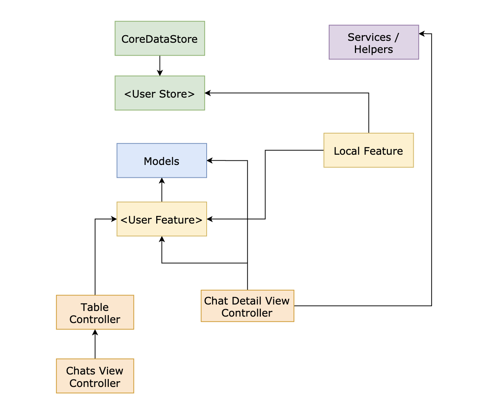

#  Parrot Chat
Parrot chat is a refactored version of my project of  [Chat Bot](https://github.com/shadyk/ChatBot) .

It is  a  mock messaging chat application that echoes any text sent.

You can find in the git commits the process from composing the models, their features, their behaviors and building up to reach the final UI and integration.

As a proof of concept, I  followed TDD to compose the `User` model and behavior and each time a change happens the tests are being modified and validate the new code. 

The project is divided to different modules seperated with protocol boundaires(`User Features`, `User Store`....) and Data Transferable Objects (`Local User`, `Managed User`)

I used Core Data to store the data and these major patterns : 

- Singleton for User generation 
- Observer pattern to refresh when a new messaged added 
- MVC design pattern for `User View Controller` 
- Composer pattern
- and just "Massive" View Controller  for `Chat Detail View Controller` to show the bad design (check the design image below)

The project is designed to handle future changes and requests : 
 
 - We can replace any module by another easily (`User Defaults` instead of `Core Data`)
 - We can implement the features to another module ( i.e. remote api)
 - Delete functionality 

